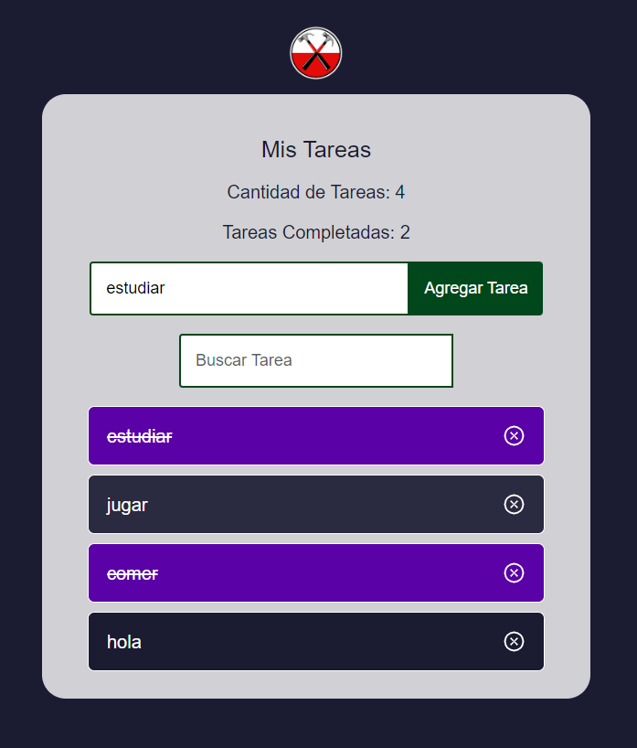

## TRABAJO PRACTICO 1 PWA 

### `Integrantes :`
- Navarro Pablo FAI-4284
- Nagel Sabio, Juan Manuel FAI-2595

    

### `Funciones :`
- index.js:  En un proyecto de React creado usando Create React App, el      archivo index.js es el punto de entrada de la aplicación. Es donde la  aplicación React se monta en el DOM.  
- App.js: En un proyecto de React es el archivo donde se define el componente principal de la aplicación. Este componente se renderiza en el archivo "index.js" y es el punto de entrada de la aplicación. En el archivo "App.js" se pueden definir las propiedades, el estado y los métodos del componente principal, así como la estructura de la interfaz de usuario que se mostrará en la aplicación. 
- index.css:  Contiene los estilos para el punto  de entrada del sitio web.
- package-json.js: Es un archivo de configuración que contiene información sobre el proyecto, incluyendo sus dependencias, scripts y metadatos. Este archivo es utilizado por el gestor de paquetes npm para administrar las dependencias del proyecto y ejecutar scripts.

### `Librerias utilizadas :`
- uuid:  Se utiliza para generar un identificador único.
        Para instalarlo, en la terminal ejecutar 'npm install uuid'.
        Luego se debe importar 'import { v4 as uuidv4 } from 'uuid' '
        Cuando querramos asignarle un identificador unico a una variable , usamos 'const id = uuidv4()'.

## Scripts Disponibles

En el directorio del proyecto, puedes ejecutar:

### `npm start`

Ejecuta la aplicación en modo de desarrollo.\
Abre [http://localhost:3000](http://localhost:3000) para verlo en tu navegador.

La página se recargará cuando hagas cambios.
También podrás ver errores de lint en la consola.

### `npm test`

Ejecuta el corredor de pruebas en modo interactivo de observación.\
Consulata la seccion sobre [running tests](https://facebook.github.io/create-react-app/docs/running-tests) para mas informacion.

### `npm run build`

Construye la aplicación para producción en la carpeta `build`.
Agrupa correctamente React en modo de producción y optimiza la construcción para obtener el mejor rendimiento.

La construcción está minimizada y los nombres de archivo incluyen los hash.
¡Tu aplicación está lista para ser ejecutada!

Consulata la seccion sobre [deployment](https://facebook.github.io/create-react-app/docs/deployment) para mas informacion.

### `npm run eject`

**Nota: esta es una operación de un solo sentido. Una vez que realizes `eject`, no puedes volver atras!**

Si no estás satisfecho con la herramienta de construcción y las opciones de configuración, puedes `eject` en cualquier momento. Este comando eliminará la única dependencia de construcción de tu proyecto.

En su lugar, copiará todos los archivos de configuración y las dependencias transitivas (webpack, Babel, ESLint, etc.) directamente en tu proyecto para que tengas control total sobre ellos. Todos los comandos excepto `eject` seguirán funcionando, pero apuntarán a los scripts copiados para que puedas modificarlos. En este punto, estás por tu cuenta.

No es necesario que uses `eject`. El conjunto de características curadas es adecuado para implementaciones pequeñas y medianas, y no deberías sentirte obligado a usar esta característica. Sin embargo, entendemos que esta herramienta no sería útil si no pudieras personalizarla cuando estés listo para hacerlo.

